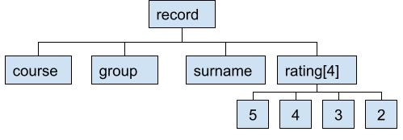
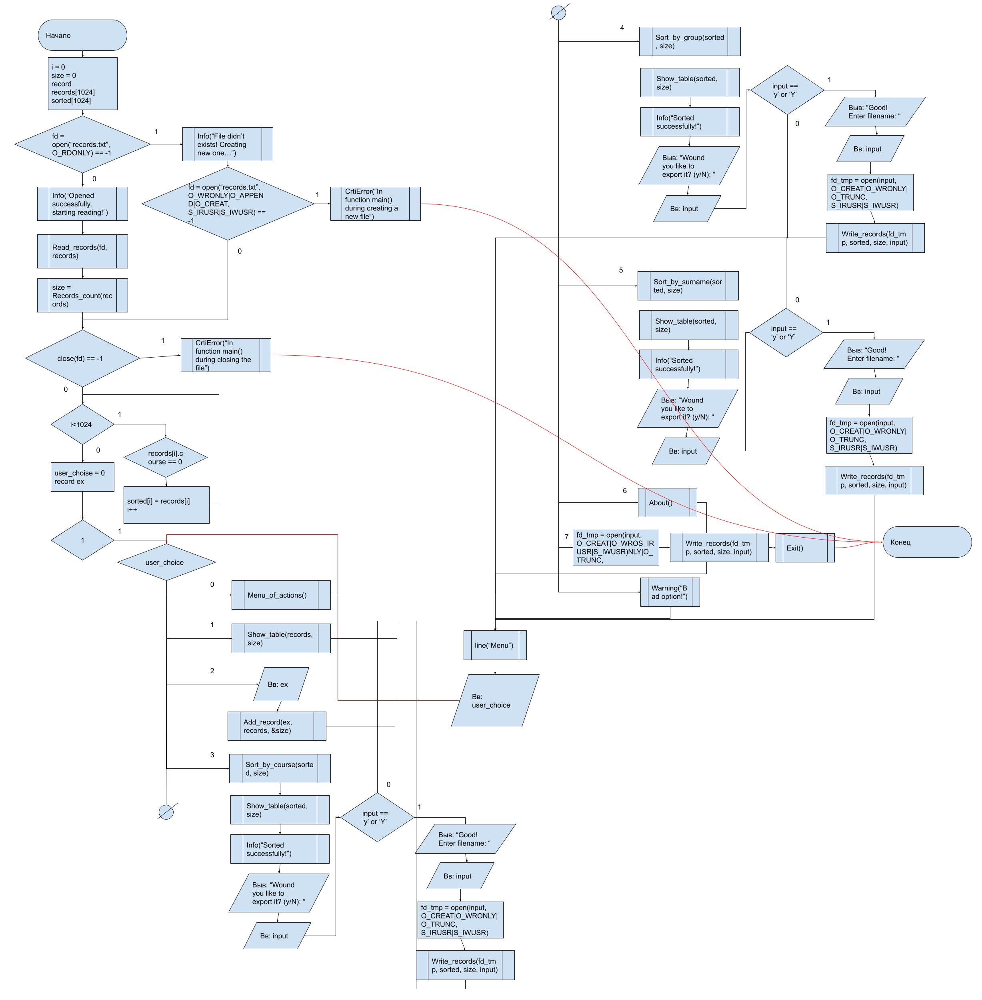

# Summer practice in the university

[Telegram](https://t.me/fectosha)

[Telegram Channel](https://t.me/varlife)

## Evaluation

## My progress:
* [Certificate](#certificate) ✅
* [Program](#program) ✅
* GIT ✅
* [Report](#report) ✅
* [Electronic sign](#electronic-sign) ✅
* [Presentation](#presentation) ✅
* [Video](#video) ✅

# Stages
## Certificate

# Program:
## My task:

## Algorithms

## Google Tests

## Screenshots

# Report

# Electronic sign

# Presentation

# Video

